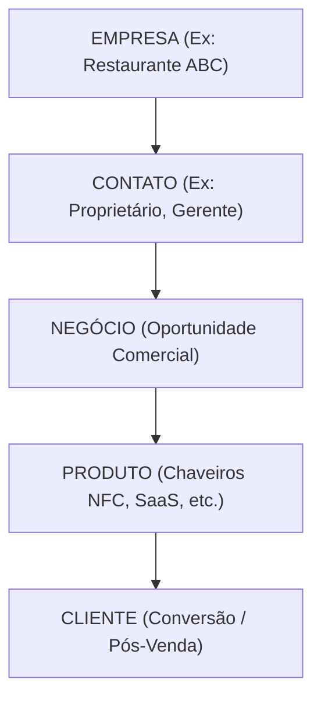

# CRM Architecture — Arquitetura de Objetos

## Objetos Principais

### 1. Contatos
* **Definição:** Representa uma pessoa física relacionada à Creative Print.
* **Exemplos:**
  - Proprietário de restaurante
  - Fotógrafo
  - Cliente SaaS
  - Responsável de uma empresa

### 2. Empresas
* **Definição:** Representa uma organização ou negócio. Será utilizado principalmente para clientes B2B.
* **Exemplos:**
  - Restaurante ABC
  - Academia XYZ
  - Clínica Maria

### 3. Negócios
* **Definição:** Representa uma oportunidade comercial. Cada venda potencial deverá possuir um negócio associado.

### 4. Tickets
* **Definição:** Representará solicitações de suporte e atendimento após a venda.

---

## Modelo de Relacionamento

### Por que essa estrutura?
A Creative Print adotará uma estrutura baseada em empresas porque seu crescimento futuro será direcionado principalmente ao mercado B2B.

Um mesmo cliente empresarial pode possuir múltiplos contatos:

**Exemplo:**
* **Empresa:** Restaurante ABC
* **Contatos associados:**
  - Proprietário
  - Gerente
  - Marketing

Essa estrutura evita duplicação de dados, otimiza o histórico de interações e facilita a expansão comercial (Account-Based Marketing / Sales).
