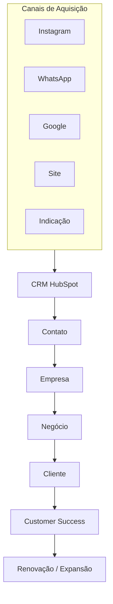

# Future State — Arquitetura Comercial

## Arquitetura Futura

### Mapa de Fluxo de Dados e Relacionamento

---

## Decisão Arquitetural

O HubSpot será considerado o **sistema central de relacionamento comercial**.

Os sistemas **CP Agenda** e **CP Review** continuarão responsáveis pela operação técnica dos produtos, enquanto o **HubSpot** será o único responsável por:

- **Aquisição**
- **Relacionamento**
- **Vendas**
- **Comunicação**
- **Segmentação**
- **Acompanhamento de Receita**
