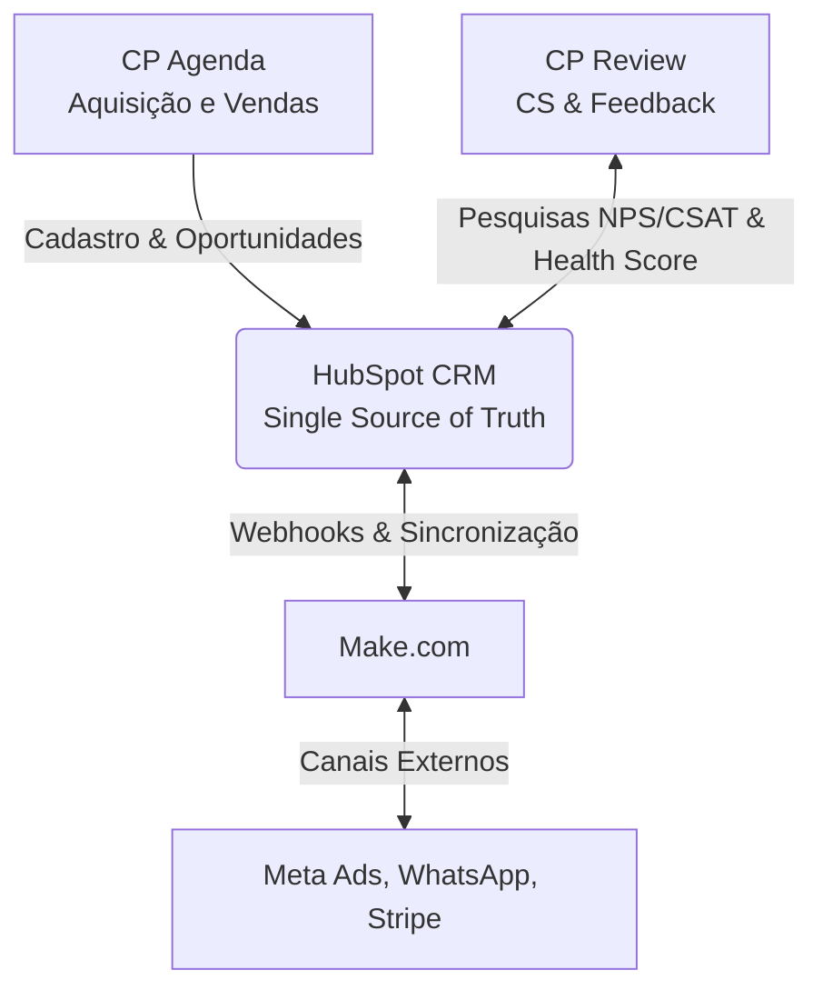

# Creative Print • Revenue Operations (RevOps) Lab

<!-- Badges de Status e Ferramentas -->
<p align="left">
  
  
  
  
  
  
  
</p>

Este repositório documenta a implementação de uma arquitetura completa de **Revenue Operations (RevOps)** e **CRM Lifecycle Marketing** utilizando o HubSpot como *Single Source of Truth* (SSOT). O projeto é desenvolvido de forma evolutiva ao longo de 12 meses, usando a **Creative Print** como estudo de caso real de implantação.

---

## 🎯 O Conceito do Laboratório

A **Creative Print** é uma empresa de tecnologia e produtos personalizados (combinando NFC, fabricação digital e soluções SaaS). Este repositório atua como um laboratório profissional de implantação integrado por meio de dois produtos reais da empresa:

*   **CP Agenda:** Foco nos processos de Aquisição de Leads, Conversão, Vendas e Onboarding.
*   **CP Review:** Foco nos processos de Customer Success, Feedback (NPS/CSAT), Retenção e Expansão de Clientes.

---

## 🏗️ Arquitetura Geral da Solução

O HubSpot atua no centro de toda a operação. A integração de canais externos e sistemas proprietários é orquestrada de forma automatizada:



---

## 📅 Roadmap Interativo da Operação (12 Meses)

Abaixo está o cronograma de implementação do ecossistema de RevOps. Cada módulo possui entregas práticas voltadas para a construção do portfólio.

| Fase | Módulo | Período | Foco Temático | Entregável Principal | Status |
| :---: | :--- | :--- | :--- | :--- | :---: |
| **01** | **CRM Foundations** | Julho 2026 | Estrutura de dados e arquitetura de objetos | `CRM Architecture Blueprint` | 🟢 Concluído |
| **02** | **Customer Journey** | Agosto 2026 | Mapeamento de jornada e ciclo de vida | `Lifecycle Architecture` | 🟡 Em Curso |
| **03** | **Marketing Operations** | Setembro 2026 | Geração previsível de demanda e formulários | `Lead Acquisition Blueprint` | ⚪ Planejado |
| **04** | **Sales Operations** | Outubro 2026 | Processo comercial e pipelines de venda | `Sales Pipeline Blueprint` | ⚪ Planejado |
| **05** | **Marketing Automation** | Novembro 2026 | Workflows, Lead Scoring e automações | `Automation Blueprint` | ⚪ Planejado |
| **06** | **Customer Success Ops** | Dezembro 2026 | Onboarding, NPS, Churn e CSAT | `Customer Success Playbook` | ⚪ Planejado |
| **07** | **Revenue Operations** | Janeiro 2027 | Integração de Marketing, Vendas e CS | `RevOps Integrated Architecture` | ⚪ Planejado |
| **08** | **Data & Business Analytics**| Fevereiro 2027 | Dashboards executivos, SQL e Looker Studio | `Executive Analytics Dashboard` | ⚪ Planejado |
| **09** | **Systems Integration** | Março 2027 | APIs, Webhooks e cenários avançados no Make | `Systems Integration Architecture` | ⚪ Planejado |
| **10** | **AI for RevOps** | Abril 2027 | Breeze AI, AEO, GEO e otimização para LLMs | `AI RevOps Strategy` | ⚪ Planejado |
| **11** | **Governance & Scalability**| Maio 2027 | Data quality, manual operacional e SOPs | `RevOps Governance Manual` | ⚪ Planejado |
| **12** | **Revenue Strategy** | Junho 2027 | Growth, Unit Economics (CAC/LTV) e OKRs | `Revenue Growth Blueprint` | ⚪ Planejado |

---

## 📂 Estrutura de Arquivos e Entregas

```bash
creative-print-revops-lab/
├── GRADE_CURRICULAR.md        # Documento mestre do programa da formação
│
├── 01-crm-architecture/       # [MÓDULO 1] Arquitetura Conceitual do CRM
│   ├── CRM_Architecture.md    # Documento mestre da arquitetura do CRM
│   ├── Business_Discovery.md  # Levantamento e requisitos da Creative Print
│   ├── Current_State.md       # Diagnóstico do cenário atual (As Is)
│   ├── Future_State.md        # Modelagem do cenário futuro do CRM (To Be)
│   ├── Data_Model.md          # Dicionário de propriedades e dados
│   ├── Naming_Convention.md   # Padronização de nomenclatura HubSpot
│   ├── Process_Design.md      # Mapeamento de processos e SLAs
│   ├── System_Mapping.md      # Arquitetura de integração CP Agenda/Review
│   └── Architecture_Decisions.md # Log de Decisões de Arquitetura (ADR)
│
├── 02-hubspot-configuration/  # [MÓDULO 2] Arquivos e Templates do CRM
│   ├── properties.xlsx        # Dicionário de propriedades para importação
│   ├── pipelines.xlsx         # Estrutura de estágios dos pipelines comerciais/CS
│   └── import_templates/      # CSVs de exemplo para carga de contatos/empresas
│
└── diagrams/                  # Diagramas e Ativos Visuais
    ├── crm_architecture.png   # Modelo físico/lógico do HubSpot CRM
    ├── customer_journey.png   # Jornada de compra e relacionamento
    └── data_model.png         # Diagrama de Entidade-Relacionamento (ERD)
```

---

## 🛠️ Como Utilizar Este Repositório

Este repositório serve como base técnica e estratégica para profissionais de Revenue Operations e consultores HubSpot.

1.  **Modelagem e Nomenclatura:** Acesse [Naming_Convention.md](file:///Users/karlateshima/Developer/Creative-Print-Revops-Lab/01-crm-architecture/Naming_Convention.md) para entender a padronização recomendada de propriedades, listas e workflows.
2.  **Configuração de CRM:** Faça o download das planilhas em [02-hubspot-configuration/](file:///Users/karlateshima/Developer/Creative-Print-Revops-Lab/02-hubspot-configuration) para criar propriedades customizadas em massa via API ou importação.
3.  **Decisões de Arquitetura:** As decisões arquiteturais que justificam a escolha de determinados pipelines e relacionamentos de objetos customizados podem ser revisadas em [Architecture_Decisions.md](file:///Users/karlateshima/Developer/Creative-Print-Revops-Lab/01-crm-architecture/Architecture_Decisions.md).

---

## 👩‍💻 Autora

**Karla Teshima**
*   [LinkedIn](https://linkedin.com) *(Insira seu link aqui)*
*   [GitHub](https://github.com/karlateshima) *(Insira seu link aqui)*
