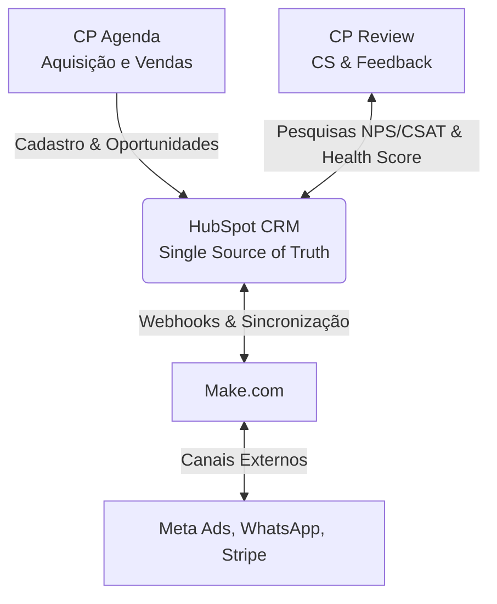

# Creative Print • Revenue Operations (RevOps) Lab

<!-- Badges de Status e Ferramentas -->
<p align="left">
  
  
  
  
  
  
  
</p>

Este repositório documenta a implantação completa e evolutiva de uma arquitetura de **Revenue Operations (RevOps)** e **Lifecycle Marketing**, utilizando a **Creative Print** como o **estudo de caso real** de mercado. 

Ao longo de **12 módulos integrados**, o sistema é construído progressivamente, transformando o **HubSpot CRM** na Fonte Única da Verdade (*Single Source of Truth - SSOT*) da operação.

---

## 🎯 O Case Real e o Propósito do Laboratório

A **Creative Print** é uma empresa de tecnologia e produtos personalizados (combinando soluções de produtos físicos NFC, impressão digital e software SaaS). 

Este laboratório não é um exercício genérico: **os 12 módulos constroem progressivamente uma operação real**, integrando dois produtos centrais da empresa:

* 📱 **CP Agenda:** Foco nos processos de Aquisição de Leads, Qualificação, Pipeline Comercial, Vendas e Onboarding de Clientes.
* 💬 **CP Review:** Foco nos processos de Customer Success, Pesquisas de Satisfação (NPS/CSAT), Retenção, Health Score e Expansão.

Cada módulo adiciona uma nova camada arquitetural (dados, processos, automações, analytics, integrações e IA), culminando em um ecossistema de receita unificado e previsível.

---

## 🏗️ Arquitetura Geral da Solução

O **HubSpot CRM** centraliza os dados de Marketing, Vendas e CS. A integração de canais externos e produtos proprietários é orquestrada via **Make.com**:


```mermaid
graph TD
    A[CP Agenda <br/> Aquisição e Vendas] -->|Cadastro & Oportunidades| C(HubSpot CRM <br/> Single Source of Truth)
    B[CP Review <br/> CS & Feedback] <-->|Pesquisas NPS/CSAT & Health Score| C
    C <-->|Webhooks & Sincronização| D[Make.com]
    D <-->|Canais Externos| E[Meta Ads, WhatsApp, Stripe]
```

---

## 📊 Status Atual do Roadmap (12 Módulos)

| Módulo | Nome do Módulo | Status |
| :---: | :--- | :---: |
| **M1** | CRM Foundations | ✅ COMPLETED |
| **M2** | Inbound & Customer Lifecycle | 🔵 IN PROGRESS |
| **M3** | Marketing Operations | ⚪ PLANNED |
| **M4** | Sales Operations & Revenue Data Skills | ⚪ PLANNED |
| **M5** | Revenue Operations | ⚪ PLANNED |
| **M6** | Customer Success Operations | ⚪ PLANNED |
| **M7** | Marketing Automation | ⚪ PLANNED |
| **M8** | Data & Business Analytics | ⚪ PLANNED |
| **M9** | Systems Integration | ⚪ PLANNED |
| **M10** | AI, AEO & Intelligent RevOps | ⚪ PLANNED |
| **M11** | Governance & Scalability | ⚪ PLANNED |
| **M12** | Revenue Strategy | ⚪ PLANNED |

---

## 📅 Roadmap Detalhado e Laboratórios Evolutivos

Abaixo está o detalhamento dos 12 módulos e das fases práticas do laboratório Creative Print:

| Módulo | Fase do Laboratório | Período | Foco Temático & Propósito do Laboratório | Entregável Principal | Status |
| :---: | :--- | :---: | :--- | :--- | :---: |
| **M1** | **Fase 1: Fundação do CRM** | Julho 2026 | Estruturação inicial do CRM: objetos, propriedades, pipelines e nomenclaturas para CP Agenda e CP Review. | `CRM Architecture Blueprint` | ✅ COMPLETED |
| **M2** | **Fase 2: Estruturação da Jornada do Cliente** | Agosto 2026 | Mapeamento do ciclo de vida, ICP, personas, segmentação e lifecycle stages aplicados. | `Lifecycle Architecture` | 🔵 IN PROGRESS |
| **M3** | **Fase 3: Sistema de Aquisição de Leads** | Setembro 2026 | Geração previsível de demanda, landing pages, formulários e captação de leads para o CP Agenda. | `Lead Acquisition Blueprint` | ⚪ PLANNED |
| **M4** | **Fase 4: Operação Comercial & Habilidades de Dados** | Outubro 2026 | Estruturação de pipelines comerciais, negociações (deals), forecast, SLAs e produtividade em vendas. | `Sales Pipeline Blueprint` | ⚪ PLANNED |
| **M5** | **Fase 5: Integração da Operação de Receita** | Novembro 2026 | Alinhamento e integração dos processos de Marketing, Vendas e CS sob uma arquitetura única de RevOps. | `RevOps Integrated Architecture` | ⚪ PLANNED |
| **M6** | **Fase 6: Operação de Customer Success** | Dezembro 2026 | Estruturação de pós-venda no CP Review: onboarding, pesquisas NPS/CSAT, Health Score, retenção e expansão. | `Customer Success Playbook` | ⚪ PLANNED |
| **M7** | **Fase 7: Automação da Jornada** | Janeiro 2027 | Automação de processos, workflows avançados no HubSpot, lead scoring e handoff automático entre áreas. | `Automation Blueprint` | ⚪ PLANNED |
| **M8** | **Fase 8: Inteligência Analítica & Business Intelligence** | Fevereiro 2027 | Dashboards executivos, modelagem SQL para CRM/RevOps, análises em Looker Studio e GA4. | `Executive Analytics Dashboard` | ⚪ PLANNED |
| **M9** | **Fase 9: Arquitetura de Sistemas Integrados** | Março 2027 | Conexão do HubSpot como SSOT via Make.com com CP Review, Meta Lead Ads, WhatsApp e Stripe. | `Systems Integration Architecture` | ⚪ PLANNED |
| **M10** | **Fase 10: AI-Driven Revenue Operations** | Abril 2027 | Aplicação de Breeze AI, cenários com IA no Make, AEO/GEO/LLMO e governança de inteligência artificial. | `AI RevOps Strategy` | ⚪ PLANNED |
| **M11** | **Fase 11: Governança e Escalabilidade da Operação** | Maio 2027 | Padronização operacional, governança de dados, auditorias, SOPs e manuais do HubSpot e Make. | `RevOps Governance Manual` | ⚪ PLANNED |
| **M12** | **Fase 12: Revenue Growth Strategy** | Junho 2027 | Plano estratégico de crescimento previsível, Unit Economics (CAC, LTV, NRR, GRR) e OKRs de receita. | `Revenue Growth Blueprint` | ⚪ PLANNED |

---

## 📂 Estrutura de Arquivos e Entregas

```text
Creative-Print-Revops-Lab/
├── GRADE_CURRICULAR.md        # Documento mestre do programa da formação (12 Módulos)
├── README.md                  # Visão geral e roadmap do laboratório
├── index.html                 # Apresentação interativa da arquitetura
├── index.css                  # Estilização visual da apresentação
│
├── 01-crm-architecture/       # Documentação da Arquitetura do CRM e Negócio
│   ├── 00-Executive-Summary.md
│   ├── 01-Business/           # Discovery, As-Is e To-Be da Creative Print
│   ├── 02-Architecture/       # Modelagem de Objetos, Associações e Mapeamento de Sistemas
│   ├── 03-Data-Model/         # Dicionários de Dados (Company, Contact, Deal, Ticket)
│   ├── 04-Processes/          # Automação, Relatórios e Plano de Implementação
│   ├── 05-Governance/         # Decisões de Arquitetura (ADRs), Governança e Nomenclatura
│   └── 06-Project-Closure/    # Relatório de Encerramento do Módulo 1
│
├── 02-inbound-lifecycle/       # [MÓDULO 2] Inbound Marketing & Ciclo de Vida
│   ├── 00-Executive-Summary.md # Resumo executivo do Módulo 2
│   └── 01-ICP-and-Buyer-Persona/
│       ├── 01-Market-Segment-Evaluation.md # Avaliação e priorização de segmentos
│       ├── 02-Customer-Evidence-Matrix.md   # Matriz de evidências empíricas
│       └── 03-Ideal-Customer-Profile.md     # Definição do Perfil de Cliente Ideal (ICP)
│
├── 00-hubspot-configuration/  # Arquivos de Configuração e Templates
│   ├── implementation/        # Configurações de Deals e Tickets
│   ├── import_templates/      # CSVs padronizados para carga de dados
│   ├── pipelines.xlsx         # Mapeamento dos estágios de pipelines
│   └── properties.xlsx        # Dicionário de propriedades customizadas
│
├── documentation/             # Evidências de Configuração e Telas do HubSpot
│   ├── Implementation/        # Documentos detalhados de implementação
│   └── evidence/              # Evidências visuais organizadas por grupo de propriedades
│
├── assets/                    # Identidade Visual e Certificados
└── diagrams/                  # Diagramas de Arquitetura, ERD e Jornada
```

---

## 🛠️ Como Utilizar Este Repositório

Este repositório serve como base técnica e estratégica para profissionais de Revenue Operations e consultores HubSpot.

1. **Arquitetura & Governança:** Acesse [01-crm-architecture/05-Governance/01-Naming-Convention.md](01-crm-architecture/05-Governance/01-Naming-Convention.md) para entender os padrões de nomenclatura de propriedades, listas e workflows.
2. **Configuração Prática de CRM:** Utilize os templates em [00-hubspot-configuration/import_templates/](00-hubspot-configuration/import_templates/) e as planilhas de propriedades para cargas em massa no HubSpot.
3. **Decisões de Arquitetura (ADR):** Consulte as justificativas técnicas em [01-crm-architecture/05-Governance/04-Architecture-Decisions.md](01-crm-architecture/05-Governance/04-Architecture-Decisions.md).

---

## 👩‍💻 Autora

**Karla Teshima**
* [LinkedIn](https://www.linkedin.com/in/karla-teshima-revops?utm_source=share_via&utm_content=profile&utm_medium=member_ios)
* [GitHub](https://github.com/karlateshima)
